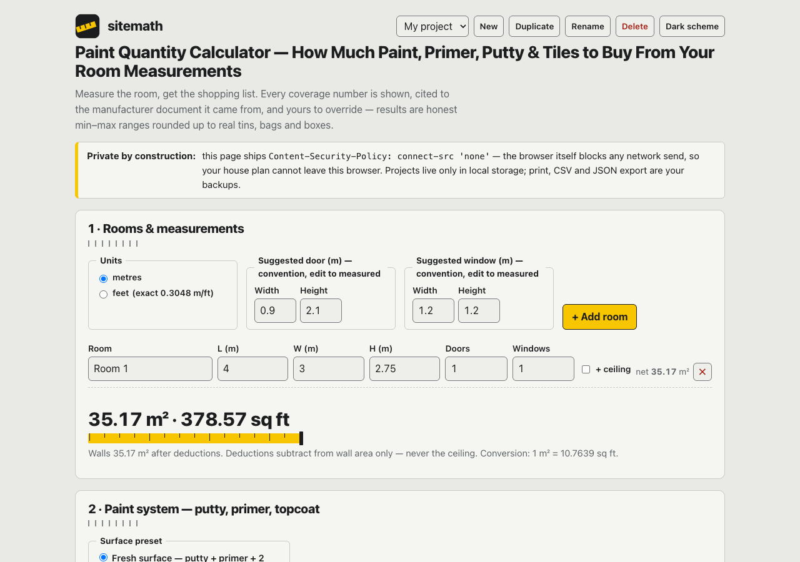

# sitemath

**Measure the room, get the shopping list.** A paint quantity calculator that turns room and
wall measurements into a buy-this-much material list — litres of paint and primer, kg of
putty, tile counts and boxes — computed from **manufacturer-published coverage bands**, every
coefficient visible, cited to its TDS, and yours to override. Results are honest min–max
ranges rounded up to real pack sizes. 100% client-side, zero dependencies, works fully
offline.



## Why

"You need 20 litres" is the most common sentence in Indian house painting, and it is almost
never accompanied by arithmetic. Every paint company publishes the number that settles it —
the coverage band on the technical data sheet — but nobody reads TDS PDFs in a paint shop.

sitemath does the reading for you and shows its work: enter length × width × height, knock
out the doors and windows, pick the product class for each layer, and get a range — never a
fake-precise single number — rounded up to the tins and bags you can actually buy. If your
tin says something different, tap the number and type yours in.

## Features

- **Room measurer** — multiple rooms, m/ft toggle (exact 0.3048 conversion), per-room
  door/window deductions with editable suggested sizes, ceiling toggle. Deductions subtract
  from wall area only — never the ceiling.
- **Paint system hero** — fresh-surface preset (putty + primer + topcoat) vs repaint preset;
  per-layer product-class picker; every layer outputs a min–max range from its cited
  coverage band.
- **Tap any coefficient** — source card with the verbatim published band, document name,
  verified-on date and a one-tap override. Overridden values are marked **your value**
  everywhere they flow; unconfirmed figures are marked **beta**.
- **Pack-fill minimizer** — rounds the worst-case litres/kg up to real packs
  (1/4/10/20 L tins, 5/40 kg putty bags): least total volume, then fewest tins, then the
  largest tin. Best-case figure shown alongside.
- **Tiles module** — catalogue-cited sizes (300×300 … 600×1200 mm) or custom mm, straight
  5% / diagonal 10% wastage (editable), box-of-N math — exact integer-mm arithmetic with a
  single round-up.
- **Handoff** — A4 print site list, RFC-4180 CSV export, full JSON backup/restore. Named
  projects (duplicate-and-tweak) in localStorage.
- **100% offline & private** — no accounts, no network calls, no tracking.

## Quickstart

Just open `index.html` in any modern browser — no build step, no server, no install.

- **Local:** double-click `index.html`, or run any static server in the folder.
- **Hosted:** **[Open sitemath live](https://sreenivas-sadhu-prabhakara.github.io/sitemath/)**

Run the self-tests (the corpus gate, every fixture and the pack-minimizer property tests)
with Node 20+:

```sh
node --test
```

## The corpus — every number is cited

All coefficients live in [`data/coeffs.js`](./data/coeffs.js) with provenance fields
(`source_title`, `source_url`, `source_quote`, `verified_how`, `verified_on`, `beta`).
Original TDS PDFs are staged under [`sources/`](./sources/) and indexed in
[`sources/CITATIONS.md`](./sources/CITATIONS.md). The hard cap of ≤ 30 coefficients is
machine-enforced by the test suite.

Where an official document could not be fetched or does not publish the number (both Berger
bands, the exterior primer, tile wastage percentages, the fresh-surface coats convention),
the row is flagged **beta**, names its secondary source, and the UI tells you to override it
with the figure on your own tin. **No number was invented.**

## Privacy

- A strict Content-Security-Policy sets `connect-src 'none'`: the app **cannot** make a
  network request even if it tried — the privacy is enforced by your browser, not promised.
- No external fonts, scripts, images or analytics; everything is self-contained.
- Projects exist only in your browser's localStorage. Print, CSV and JSON export are the
  only ways data leaves the page — on paper or into your own files.

## Honest limits

- Coverage bands are manufacturer figures for ideal, properly prepared surfaces — porosity,
  texture, thinning and application method push real consumption outside the band. Buy
  against the worst-case figure; every output is an estimate, not a guarantee.
- Coefficients were verified on the dates shown (2026-07-23); manufacturers reformulate and
  re-spec. Every value carries its verified-on date and can be overridden in one tap.
- Quantities only, never prices — the shop's bill is the price.
- Suggested door/window sizes and tile wastage percentages are stated conventions; measure
  your own openings, and complex lays can exceed the cited wastage.
- Not a site survey: dado heights, damaged plaster, extra putty coats and repair quantities
  are contractor judgment calls this app cannot make and does not fake.
- Clearing browser site data erases saved projects.

## Disclaimer

sitemath is an informational estimating aid — not professional advice, a site survey or a
quotation. Confirm quantities with your painter or contractor before purchase. Product names
belong to their owners; citation of a TDS is not endorsement by the manufacturer. Provided
**"as is"** under the [MIT License](./LICENSE), without warranty of any kind; the author
accepts no liability for purchasing decisions made with it.

© 2026 Sreenivas Sadhu Prabhakara · MIT
